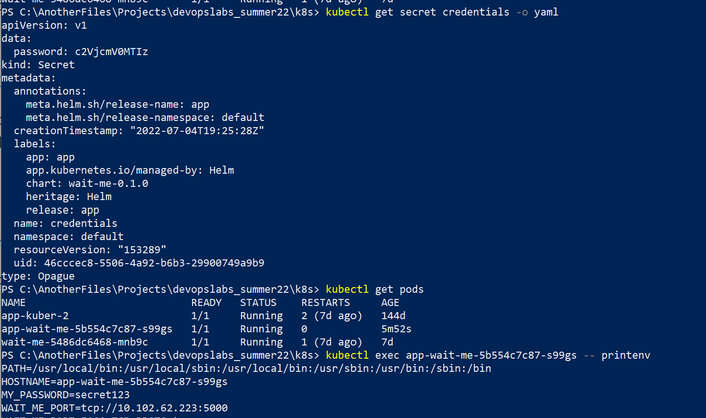

install helm secrets plugin on windows
curl -LsSf https://github.com/jkroepke/helm-secrets/releases/latest/download/helm-secrets.tar.gz | tar -C "%APPDATA%\helm\plugins" -xzf-

echo -n 'admin' > ./username.txt
echo -n 'superpass12345&*' > ./password.txt

kubectl create secret generic db-user-pass-from-file --from-file=./username.txt --from-file=./password.txt

kubectl get secret db-user-pass-from-file
kubectl get secret db-user-pass-from-file -o yaml

kubectl get secret db-user-pass-from-file -o jsonpath='{.data}'

### proof of work
{"password.txt":"//5zAHUAcABlAHIAcABhAHMAcwAxADIAMwA0ADUAJgAqAA0ACgA=","username.txt":"//5hAGQAbQBpAG4ADQAKAA=="}

choco install gnupg
refreshenv
gpg --gen-key
gpg --list-keys

choco install sops

add env variable 
$env:EDITOR = "'C:\\AnotherSoftware\\Notepad++\\notepad++.exe' -multiInst -nosession -notabbar"

sops -p 6AD90C0ED9F0945DCAD6239F11F63A7D3BBC9173 secrets.yaml
add in file:
'''
password: secret123
'''

helm secrets view .\secrets.yaml

### make templates 

helm secrets install app ./wait-me -n default -f ./secrets.yaml

kubectl get secret credentials -o yaml

### verify
kubectl get pods
kubectl exec app-wait-me-5b554c7c87-s99gs -- printenv

